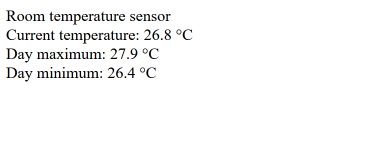

# Room temperature monitor

The ESP32 reads temperature from the BMP180 sensor and displays current temperature, daily maximum and minimum on a simple webpage accessible to anyone on the same network.

## Features

- web server hosted by ESP32
- periodic temperature reading
- daily minimum and maximum tracking
- NTP time synchronization
- daily data reset at midnight
- HTTP endpoint providing temperature data as JSON
- deep sleep after connection failures

## Hardware

- ESP32 DOIT DEVKIT V1
- BMP180 temperature and pressure sensor

### Pinout

- SCL - GPIO 22
- SDA - GPIO 21

## Software

- VS Code with PlatformIO (core v. 6.1.19)
- Adafruit_BMP085.h
- WiFi.h
- WebServer.h
- time.h

### Webpage

## Setup

1. Clone repo
2. Copy config_example.h to config.h
3. Fill in config.h with your data
4. If using different ESP32 board, change wiring
5. Connect ESP32 and upload

## Notes

- The webpage is kept simple intentionally, the goal was to keep the frontend easy to understand
- The ESP32 goes to deep sleep when initialization fails, retrying periodically

## What I learned

- Reusable initialization function
- NTP synchronisation and time handling
- Hosting simple webpage on ESP32
- Separate handlers for UI and data send
- Using typed constexpr instead of preprocesor macros